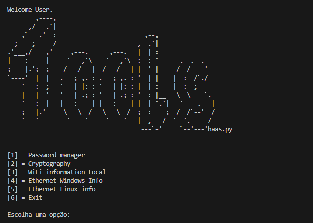

# Projeto de Treinamento de Lógica de Programação

Bem-vindo ao repositório do nosso software destinado a treinar lógica de programação e expandir conhecimentos com novas bibliotecas! Este projeto visa fornecer ferramentas úteis para criptografia, geração de senhas, informações sobre redes cabeadas e Wi-Fi, além de uma opção específica para Linux.

## Captura de Tela



## Funcionalidades

Criptografia: Ferramentas para criptografar e descriptografar dados, auxiliando no entendimento dos princípios de segurança da informação.
Gerador de Senhas: Gera mais de 380 senhas diferentes, proporcionando uma ampla gama de combinações para melhorar a segurança das suas contas.
Informações de Rede: Exibe informações detalhadas sobre redes cabeadas e Wi-Fi, ajudando a diagnosticar e resolver problemas de conectividade.
Compatibilidade com Linux: Funções específicas para usuários de Linux, garantindo que o software seja útil em diferentes ambientes de desenvolvimento.

## Tecnologias Utilizadas

Linguagem: Python 3.11.9

## Bibliotecas
Este projeto utiliza diversas bibliotecas para expandir suas funcionalidades:

- comtypes==1.4.5
- customtkinter==5.2.2
- darkdetect==0.8.0
- distlib==0.3.8
- filelock==3.14.0
- packaging==24.1
- pillow==10.3.0
- platformdirs==4.2.2
- psutil==6.0.0
- pywifi==1.1.12
- virtualenv==20.26.2
- Estrutura do Código

O código foi desenvolvido com uma estrutura limpa e compreensível, embora ainda haja espaço para melhorias. Este é um projeto em andamento, com planos para atualizações futuras que adicionarão novas funcionalidades e aperfeiçoarão as existentes.

## Contribuição

Este projeto teve contribuições em diversas áreas, especialmente no uso de bibliotecas que eram novas para o desenvolvedor principal. Agradecemos a todos que ajudaram e incentivamos mais contribuições para tornar este software ainda melhor.

## Instalação
Para instalar e executar o projeto, siga os passos abaixo:

1. Clone este repositório:
   ```sh
   cd seu_repositorio

2. Navegue até o diretório do projeto:
   ```sh
   git clone https://github.com/seu_usuario/seu_repositorio.git

3. Crie um ambiente virtual:
   ```sh
   python -m venv venv
   
4. Ative o ambiente virtual:
- No windows:
   ```sh
   venv\Scripts\activate
- No Linux/MacOS:
  ```sh
  source venv/bin/activate
  
5. Instale as dependências:
   ```sh
   pip install -r requirements.txt

6. Execute o software:
    ```sh
    python main.py

## Futuras Atualizações
Planejamos incluir mais funcionalidades e melhorar a usabilidade do software com o tempo. Fique atento às atualizações no repositório!

## Licença
Este projeto está sob a licença [copyright ©]. Consulte o arquivo LICENSE para obter mais informações.

